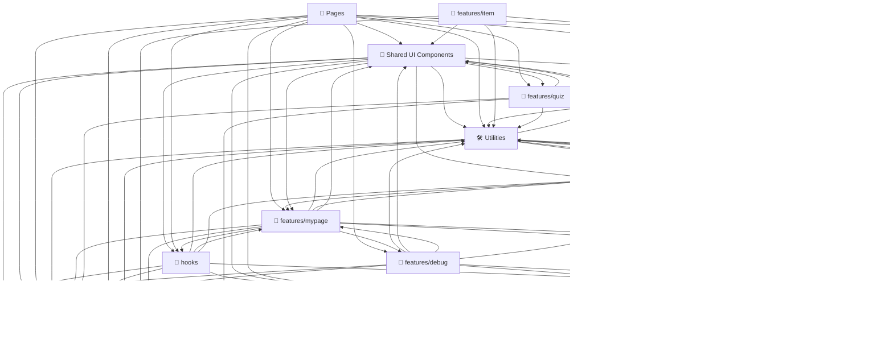

# 🧗‍♂️ Solve Climb 핵심 로직 흐름도 (Code Flowchart)

이 문서는 프로젝트 내 주요 폴더(아키텍처) 및 핵심 비즈니스 로직(화면, 전역 상태, 데이터베이스) 간의 관계를 시각적으로 나타냅니다.
코드가 업데이트되거나 커밋될 때 자동으로 빌드되어 최신화됩니다.

---

## 🏛️ 1. 아키텍처 폴더 흐름도 (Architecture Level)
프로젝트 내 대분류 폴더 간의 상호작용 및 데이터 흐름을 나타냅니다. (가장 거시적인 구조도)

---

## 🎯 2. 핵심 모듈 흐름도 (Core File Level)
UI 모달, 토스트 등의 단순 디자인 파일을 제외한 **페이지(Pages), 상태 저장소(Zustand Stores), 핵심 기능 진입점(Features)** 간의 실질적인 호출 관계도입니다.

```mermaid
graph TD
  subgraph other ["📁 other"]
    src_App_tsx["App"]
    src_main_tsx["main"]
  end

  subgraph pages ["📄 Pages"]
    src_pages_CategorySelectPage_tsx["CategorySelectPage"]
    src_pages_DebugPage_tsx["DebugPage"]
    src_pages_HomePage_tsx["HomePage"]
    src_pages_LevelSelectPage_tsx["LevelSelectPage"]
    src_pages_NotificationPage_tsx["NotificationPage"]
    src_pages_PrivacyPolicyPage_tsx["PrivacyPolicyPage"]
    src_pages_QuizPage_tsx["QuizPage"]
    src_pages_RankingPage_tsx["RankingPage"]
    src_pages_ResultPage_tsx["ResultPage"]
    src_pages_ReviewPage_tsx["ReviewPage"]
    src_pages_RoadmapPage_tsx["RoadmapPage"]
  end

  subgraph services ["🔌 Services"]
    src_services_analytics_ts["analytics"]
    src_services_historyService_ts["historyService"]
    src_services_index_ts["index"]
    src_services_IStorageService_ts["IStorageService"]
    src_services_LevelSyncService_ts["LevelSyncService"]
    src_services_LocalStorageService_ts["LocalStorageService"]
    src_services_MockStorageService_ts["MockStorageService"]
    src_services_storageKeys_ts["storageKeys"]
  end

  subgraph stores ["📦 Zustand Stores"]
    src_stores_useAuthStore_ts["useAuthStore"]
    src_stores_useBadgeStore_ts["useBadgeStore"]
    src_stores_useBaseCampStore_ts["useBaseCampStore"]
    src_stores_useDailyRewardStore_ts["useDailyRewardStore"]
    src_stores_useDeathNoteStore_ts["useDeathNoteStore"]
    src_stores_useDebugStore_ts["useDebugStore"]
    src_stores_useErrorLogStore_ts["useErrorLogStore"]
    src_stores_useFavoriteStore_ts["useFavoriteStore"]
    src_stores_useFeatureFlagStore_ts["useFeatureFlagStore"]
    src_stores_useGameStore_ts["useGameStore"]
    src_stores_useLevelProgressStore_ts["useLevelProgressStore"]
    src_stores_useLoadingStore_ts["useLoadingStore"]
    src_stores_useNotificationStore_ts["useNotificationStore"]
    src_stores_useProfileStore_ts["useProfileStore"]
    src_stores_useQuizStore_ts["useQuizStore"]
    src_stores_useRankingStore_ts["useRankingStore"]
    src_stores_useSettingsStore_ts["useSettingsStore"]
    src_stores_useToastStore_ts["useToastStore"]
    src_stores_useUserStore_ts["useUserStore"]
  end

  subgraph utils ["🛠️ Utilities"]
    src_utils_errorHandler_ts["errorHandler"]
    src_utils_haptic_ts["haptic"]
    src_utils_supabaseClient_ts["supabaseClient"]
  end

  subgraph features_auth ["📁 features/auth"]
    src_features_auth_index_ts["index"]
  end

  subgraph features_debug ["📁 features/debug"]
    src_features_debug_index_ts["index"]
  end

  subgraph features_item ["📁 features/item"]
    src_features_item_index_ts["index"]
    src_features_item_pages_ShopPage_tsx["ShopPage"]
  end

  subgraph features_mypage ["📁 features/mypage"]
    src_features_mypage_index_ts["index"]
    src_features_mypage_pages_MyPage_tsx["MyPage"]
  end

  subgraph features_quiz ["📁 features/quiz"]
    src_features_quiz_index_ts["index"]
    src_features_quiz_components_QuizLayout_tsx["QuizLayout"]
    src_features_quiz_services_LevelSyncService_ts["LevelSyncService"]
  end

  %% Relations
  src_App_tsx --> src_stores_useLevelProgressStore_ts
  src_App_tsx --> src_stores_useAuthStore_ts
  src_App_tsx --> src_stores_useErrorLogStore_ts
  src_App_tsx --> src_stores_useDebugStore_ts
  src_App_tsx --> src_stores_useSettingsStore_ts
  src_App_tsx --> src_features_auth_index_ts
  src_pages_CategorySelectPage_tsx --> src_stores_useLevelProgressStore_ts
  src_pages_CategorySelectPage_tsx --> src_stores_useFavoriteStore_ts
  src_pages_CategorySelectPage_tsx --> src_stores_useDebugStore_ts
  src_pages_CategorySelectPage_tsx --> src_services_index_ts
  src_pages_DebugPage_tsx --> src_features_debug_index_ts
  src_pages_HomePage_tsx --> src_stores_useDailyRewardStore_ts
  src_pages_LevelSelectPage_tsx --> src_services_index_ts
  src_pages_NotificationPage_tsx --> src_stores_useNotificationStore_ts
  src_pages_QuizPage_tsx --> src_features_quiz_index_ts
  src_pages_ResultPage_tsx --> src_stores_useQuizStore_ts
  src_pages_ResultPage_tsx --> src_stores_useLevelProgressStore_ts
  src_pages_ResultPage_tsx --> src_stores_useRankingStore_ts
  src_pages_ResultPage_tsx --> src_stores_useUserStore_ts
  src_pages_ResultPage_tsx --> src_stores_useToastStore_ts
  src_pages_ResultPage_tsx --> src_utils_supabaseClient_ts
  src_pages_ResultPage_tsx --> src_utils_errorHandler_ts
  src_pages_ResultPage_tsx --> src_services_analytics_ts
  src_pages_ResultPage_tsx --> src_stores_useSettingsStore_ts
  src_pages_ResultPage_tsx --> src_services_historyService_ts
  src_pages_ResultPage_tsx --> src_services_index_ts
  src_pages_ReviewPage_tsx --> src_features_mypage_index_ts
  src_services_historyService_ts --> src_services_index_ts
  src_services_index_ts --> src_services_LocalStorageService_ts
  src_services_LocalStorageService_ts --> src_services_IStorageService_ts
  src_services_MockStorageService_ts --> src_services_IStorageService_ts
  src_stores_useAuthStore_ts --> src_utils_supabaseClient_ts
  src_stores_useAuthStore_ts --> src_services_index_ts
  src_stores_useAuthStore_ts --> src_services_analytics_ts
  src_stores_useBadgeStore_ts --> src_utils_supabaseClient_ts
  src_stores_useBadgeStore_ts --> src_services_index_ts
  src_stores_useDailyRewardStore_ts --> src_utils_supabaseClient_ts
  src_stores_useFeatureFlagStore_ts --> src_services_index_ts
  src_stores_useGameStore_ts --> src_services_index_ts
  src_stores_useLevelProgressStore_ts --> src_utils_supabaseClient_ts
  src_stores_useLevelProgressStore_ts --> src_stores_useDebugStore_ts
  src_stores_useLevelProgressStore_ts --> src_stores_useToastStore_ts
  src_stores_useLevelProgressStore_ts --> src_services_LevelSyncService_ts
  src_stores_useProfileStore_ts --> src_stores_useLevelProgressStore_ts
  src_stores_useProfileStore_ts --> src_services_index_ts
  src_stores_useRankingStore_ts --> src_utils_supabaseClient_ts
  src_stores_useRankingStore_ts --> src_stores_useToastStore_ts
  src_stores_useUserStore_ts --> src_utils_supabaseClient_ts
  src_stores_useUserStore_ts --> src_stores_useDebugStore_ts
  src_utils_errorHandler_ts --> src_stores_useErrorLogStore_ts
  src_utils_errorHandler_ts --> src_services_analytics_ts
  src_utils_haptic_ts --> src_stores_useSettingsStore_ts
  src_features_mypage_pages_MyPage_tsx --> src_features_debug_index_ts
  src_features_mypage_pages_MyPage_tsx --> src_stores_useProfileStore_ts
  src_features_mypage_pages_MyPage_tsx --> src_stores_useSettingsStore_ts
  src_features_mypage_pages_MyPage_tsx --> src_stores_useFavoriteStore_ts
  src_features_mypage_pages_MyPage_tsx --> src_stores_useLevelProgressStore_ts
  src_features_mypage_pages_MyPage_tsx --> src_stores_useQuizStore_ts
  src_features_mypage_pages_MyPage_tsx --> src_utils_haptic_ts
  src_features_mypage_pages_MyPage_tsx --> src_utils_supabaseClient_ts
  src_features_mypage_pages_MyPage_tsx --> src_utils_errorHandler_ts
  src_features_mypage_pages_MyPage_tsx --> src_services_index_ts
  src_features_quiz_services_LevelSyncService_ts --> src_utils_supabaseClient_ts
  src_features_quiz_services_LevelSyncService_ts --> src_utils_errorHandler_ts
```

---

## 💡 구성 요소 설명
* **📄 Pages**: 프로젝트의 메인 화면 단위 페이지들입니다.
* **📦 Zustand Stores**: 사용자 인증, 배지, 설정 등의 상태를 중앙 관리하는 전역 스토어입니다.
* **🔌 Services / Utilities**: API 클라이언트(Supabase) 및 진동/시간 계산 유틸리티들입니다.
* **📁 features/***: 로그인, 퀴즈, 마이페이지 등 도메인별 기능 컴포넌트 및 비즈니스 로직 진입점 영역입니다.
